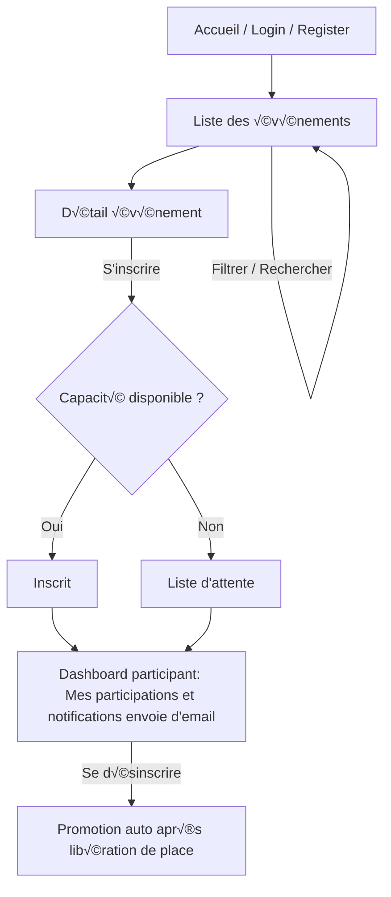
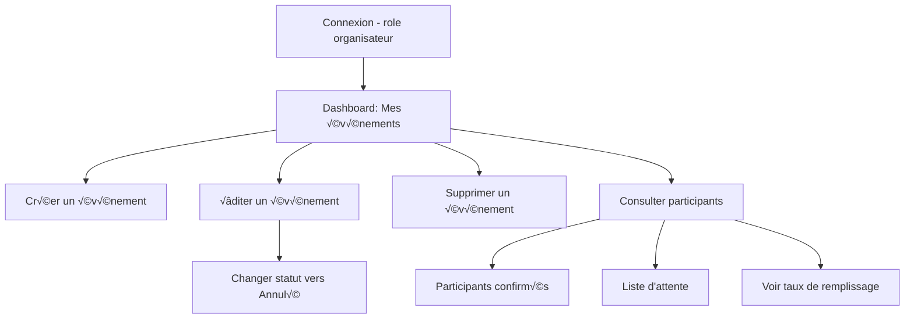
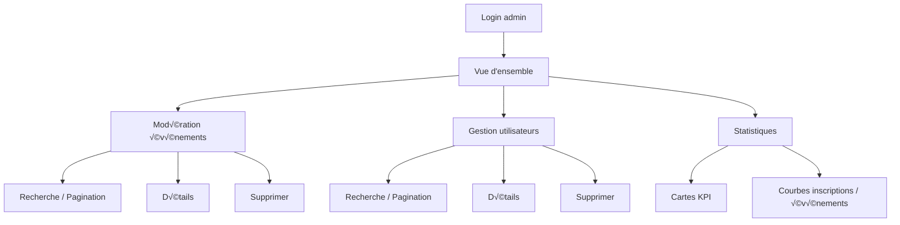

# EventConnect

Gestion d'événements (frontend React + backend Laravel) avec rôles (participant, organisateur, admin), inscriptions, liste d'attente, notifications, dashboard, pagination/filtre/recherche.

## Fonctionnalités clés

- Authentification (register/login/logout), rôles: participant, organisateur, admin
- Catalogue d'événements: pagination, recherche, tags, statut (publié/annulé/expiré)
- Détails d'un événement: image par défaut, badges (inscrit/en_attente/expiré/annulé)
- Participation: inscription, désinscription, promotion auto de la liste d’attente
- Dashboard participant/organisateur
  - Organisateur: gestion de ses événements, liste des participants, stats de remplissage
- Dashboard administrateur
  - Modération des événements (datatable + recherche/pagination)
  - Gestion des utilisateurs (datatable + recherche/pagination)
  - Statistiques globales + graphique interactif (inscriptions/utilisateurs et événements par mois)
- Notifications email: à l'inscription d'un participant et à la création d'un événement par un organisateur

## Prérequis

- Node.js 18+
- PNPM ou NPM
- PHP 8.2+
- Composer
- MySQL/MariaDB (ou SQLite pour test rapide)

## Démarrage rapide

Chemin des projets:

- Backend: `eventconnect-backend/`
- Frontend: `eventconnect-frontend/`

### 1) Backend (Laravel)

1. Copier l'environnement:
   - `cd eventconnect-backend`
   - `cp .env.example .env`
2. Configurer la base de données dans `.env` (DB_DATABASE, DB_USERNAME, DB_PASSWORD).
3. Installer les dépendances: `composer install`
4. Générer la clé d'application: `php artisan key:generate`
5. Migrer la base de données: `php artisan migrate`
6. (Recommandé) Peupler toutes les données de démo avec le seeder principal:
   - `php artisan db:seed` (exécute `DatabaseSeeder` qui appelle `CategorySeeder`,  `UserSeeder`, `EventSeeder`, `AdminUserSeeder`)
7. Créer/mettre à jour l'admin (si besoin de rejouer séparément):
   - `php artisan db:seed --class=Database\Seeders\AdminUserSeeder`
   - Identifiants: `admin@example.com` / `password`
8. Lancer l’API: `php artisan serve` (par défaut: `http://localhost:8000`)

Notes d'authentification: Laravel Sanctum (header Authorization: Bearer `<token>` géré côté frontend).

#### Backend `.env.example` (email et envoi de mails)

Le fichier `eventconnect-backend/.env.example` contient une configuration SMTP fonctionnelle d’exemple:

```
MAIL_MAILER=smtp
MAIL_HOST=smtp.gmail.com
MAIL_PORT=587
MAIL_USERNAME=infiniterraetincelle@gmail.com
MAIL_PASSWORD="<mot_de_passe_application>"
MAIL_FROM_ADDRESS="noreply@eventconnect.com"
MAIL_FROM_NAME="EventConnect"
```

Deux options pour recevoir réellement les emails:

- Utiliser le compte d’exemple `infiniterraetincelle@gmail.com` (si laissé actif) avec un « mot de passe d’application » Google.
- OU remplacer par votre propre compte Gmail: activez l’authentification à deux facteurs (2FA), puis générez un « mot de passe d’application » et placez-le dans `MAIL_PASSWORD` (NE PAS utiliser votre mot de passe normal). Gardez `MAIL_HOST=smtp.gmail.com` et `MAIL_PORT=587`.

Pensez aussi à définir `FRONTEND_URL`/`FRONTEND_URL2` si vous changez les ports du frontend (liens dans les emails et CORS).

### 2) Frontend (React + Vite)

1. `cd eventconnect-frontend`
2. Installer les dépendances: `pnpm install` ou `npm install`
3. Configurer l’URL de l’API (si besoin):
   - Créer `.env` et définir `VITE_API_URL=http://localhost:8000/api`
4. Démarrer: `pnpm dev` ou `npm run dev` (par défaut: `http://localhost:5173`)

#### Frontend `.env.example`

Le fichier `eventconnect-frontend/.env.example` expose les variables suivantes:

```
VITE_API_URL=http://localhost:8000/api  # Base URL de l'API Laravel
VITE_APP_NAME=EventConnect              # Nom de l'app (affichage éventuel)
VITE_APP_URL=http://localhost:5173      # URL locale du frontend
```

- Modifiez `VITE_API_URL` si votre backend tourne ailleurs (ex: Docker, autre port).

### 3) Connexions de test

- Admin: `admin@example.com` / `password`
- Vous pouvez créer un participant/organisateur via l'inscription, puis modifier le rôle dans la BD si nécessaire.

## Parcours utilisateurs (workflow)

- Participant
  - S’inscrire / Se connecter
  - Consulter la liste des événements (`/events`), rechercher et filtrer
  - Ouvrir un événement, s’inscrire (ou rejoindre la liste d’attente si complet)
  - Voir ses participations depuis le dashboard participant; se désinscrire si besoin
- Organisateur
  - Se connecter (rôle `organisateur`)
  - Dashboard: `Mes événements` (`/dashboard/events`): créer, éditer, supprimer
  - Voir les participants d’un événement: confirmés / liste d’attente, taux de remplissage
  - Marquer un événement annulé (les participants reçoivent une notification)
- Administrateur
  - Se connecter (rôle `admin`)
  - Vue d’ensemble admin: `/dashboard/admin`
  - Modération des événements: `/dashboard/admin/events` (datatable: recherche/pagination, détails, suppression)
  - Gestion des utilisateurs: `/dashboard/admin/users` (datatable: recherche/pagination, détails, suppression)
  - Statistiques globales: `/dashboard/admin/stats` (cartes + graphique interactif mensuel: inscriptions & événements)

## Schémas (workflows)

### Participant



### Organisateur



### Administrateur




## Ì≥ö Documentation API (Swagger)

Le backend Laravel inclut une documentation Swagger complète et interactive :

### Accès à Swagger

1. **Démarrer le backend** : `php artisan serve`
2. **Ouvrir dans le navigateur** : `http://localhost:8000/api/documentation`
3. **Interface interactive** : Testez tous les endpoints directement depuis le navigateur

### Fonctionnalités Swagger

- **Authentification** : Utilisez le token Bearer pour tester les routes protégées
- **Endpoints documentés** :
  - **Auth** : `/api/auth/*` (login, register, profile)
  - **Events** : `/api/events/*` (CRUD des événements)
  - **Categories** : `/api/categories` (liste des catégories)
  - **Participations** : `/api/participations/*` (inscription aux événements)
  - **Admin** : `/api/admin/*` (statistiques, modération)
- **Schémas de données** : Modèles complets avec validation
- **Exemples de requêtes/réponses** : Pour chaque endpoint

### Comment utiliser Swagger

1. **Se connecter** : Utilisez `/api/auth/login` pour obtenir un token
2. **Authentifier** : Cliquez sur "Authorize" et entrez `Bearer <votre_token>`
3. **Tester** : Cliquez sur nimporte
## Scripts utiles

Backend:

- Lancer le serveur: `php artisan serve`
- Migrations: `php artisan migrate`
- Seeders: `php artisan db:seed`

Frontend:

- Dev server: `npm run dev`
- Build: `npm run build`

## Structure des dossiers (extrait)

- `eventconnect-backend/app/Http/Controllers/` — Contrôleurs (Events, Participations, Admin)
- `eventconnect-backend/app/Http/Resources/` — API Resources (Event, EventDetail)
- `eventconnect-backend/app/Notifications/` — Notifications (annulation)
- `eventconnect-frontend/src/pages/` — Pages (auth, events, dashboard, admin)
- `eventconnect-frontend/src/components/` — UI (NavBar, Dialogs, Charts, Tables)
- `eventconnect-frontend/src/lib/api/` — Appels API (axios, events, participations, auth)

## Licence

Projet pédagogique — usage académique/démonstration.
